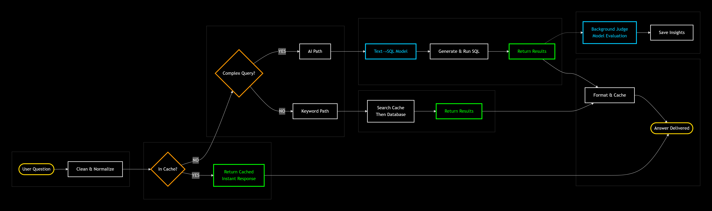

# AI Architecture Deep Dive

## API Endpoint

The AI implementation is accessible at: [http://localhost:3000/api/ai/query](http://localhost:3000/api/ai/query)

## System Flow

 

### Core Request Pipeline

| Step | Component | Description |
|------|-----------|-------------|
| **1. Query Reception** | Frontend → API | User submits natural language question |
| **2. Cache Check** | Exact-match cache | Returns cached response if exact normalized query seen within 5 min |
| **3. Complexity Scoring** | `requiresAIPath()` function | Scores query based on aggregations, entity mentions, phrase patterns; threshold ≥4 triggers AI path |
| **4a. Simple Path** | Keyword Search | Extracts keywords, checks keyword cache, then searches `searchText` using PostgreSQL full-text |
| **4b. Complex Path** | Text-to-SQL Model | Generates SQL → post-processing fixes → executes against database |
| **5. Response Generation** | Response Model | Formats results into conversational answer |
| **6. Evaluation** | Judge Model | Asynchronously scores SQL quality and logs results |

### Detailed Flow Description

#### 1. Query Reception
When a user interacts with the AI chatbot by sending a query, the application executes the following decision tree.

#### 2. Cache Check
The application first checks if the exact query was sent within the past 5 minutes:
- **Cache HIT**: Returns cached results immediately
- **Cache MISS**: Proceeds to complexity analysis

#### 3. Query Classification
The application determines whether the user prompt requires AI assistance:

**A. Keyword Search Path (Low Complexity)**
If the query is not complex enough to need the TEXT2SQL_MODEL:
1. Check for cached table data
2. If cache MISS, query searchText fields (pre-optimized for rapid lookup)
3. Store both query (as key) and results in cache
4. Proceed to response generation

**B. AI Path (High Complexity)**
If the TEXT2SQL_MODEL is required:
1. Send user query to TEXT2SQL_MODEL
2. Convert natural language to SQL
3. Execute generated SQL against PostgreSQL
4. Proceed to response generation

#### 4. Response Generation
All results paths converge at the AI_RESPONSE_MODEL:
- Keyword search results
- AI-generated query results
- Cached query results

The response model converts raw data into human-friendly format before returning to the frontend chatbot.

> **Note**: This flow could be improved if cache were set AFTER human-friendly responses were generated and validated, so valid responses could immediately be returned to the user and responses would not need to be generated every time. However, a more robust validation step would be necessary to prevent invalid responses from being cached.

#### 5. Non-Blocking Evaluation
The JUDGE_MODEL operates asynchronously, not blocking user response:

**Evaluation Logic**:
- **Test set matches**: If query matches `src/server/aiTest/test-questions.json`, compare resultsCount against expected count from ground truth. (See also: `src/server/aiTest/test_questions.md` for quick copy/paste testing)
- **No match**: LLM-as-Judge autonomously evaluates quality

**Output**: Scores and explanations are saved to: `src/server/aiTest/judgements/`

### Component Details

#### Text-to-SQL Model (7B)

| Aspect | Current Implementation | Production Target |
|--------|------------------------|-------------------|
| **Purpose** | Convert natural language to PostgreSQL queries | Same |
| **Model** | Generic 7B with prompt engineering | Fine-tuned on company-specific query patterns |
| **Post-processing** | Extensive regex fixes: SQL extraction, quote fixing, UNION correction, identifier validation | Fine-tuning would eliminate most post-processing |
| **Limitations** | May hallucinate tables/columns; requires aggressive cleaning; not all models follow instructions | Specialized model would generate cleaner SQL |

#### Response Model (7B)

| Aspect | Current Implementation | Production Target |
|--------|------------------------|-------------------|
| **Purpose** | Transform raw data into natural language answers | Same |
| **Model** | Generic 7B with instruction prompts | Fine-tuned on company tone and terminology |
| **Note** | Same model also serves as Judge (dual-purpose) | Would use specialized models in production |

#### Judge Model (7B)

| Aspect | Current Implementation | Production Target |
|--------|------------------------|-------------------|
| **Purpose** | Asynchronous quality evaluation | Same + human validation |
| **Logic** | Test set match → compare counts; No match → LLM-as-Judge | Add semantic correctness checks, human sampling |
| **Limitations** | Count comparison doesn't verify data correctness; LLM-judge accuracy bounded by model capabilities | Human validation would catch subtle errors |

### Design Decisions & Trade-offs

| Decision | Why | Trade-off |
|----------|-----|-----------|
| **Model specialization** | Each task (SQL, response, evaluation) has different requirements | More complex orchestration |
| **Non-blocking evaluation** | Users get immediate responses | Quality feedback is delayed |
| **Local-only models** | Data privacy, no API costs | Limited to 7B parameter models |
| **5-minute TTL cache** | Simple implementation | Misses semantic similarities |
| **Dual-purpose response/judge model** | Reduces resource requirements | May compromise performance of both tasks |
| **In-memory caching** | Fast, simple for prototype | **Does not scale** beyond small datasets (RAM limits, no distribution) |
| **Rule-based complexity scoring** | Zero-cost, transparent routing | **Brittle at scale** - misses novel query patterns; would need ML-based classifier for production |

### Caching Strategy

| Aspect | Current Implementation | Production Enhancement |
|--------|------------------------|------------------------|
| **Type** | In-memory, exact-match | Semantic + partial caching |
| **TTL** | 5 minutes | Variable based on data freshness needs |
| **Scope** | Full query results | Partial results, embeddings |
| **Scale Limitation** | Works only with small datasets | Would need Redis/Memcached, sharding, and eviction policies |

### Human-in-the-Loop Considerations

For production deployment, this system would benefit from human-in-the-loop validation:

**Minimal HITL implementation**:
1. **Confidence scoring**: Flag low-quality SQL for human review
2. **Review queue**: Simple interface for verifying uncertain queries
3. **Feedback loop**: Use corrections to augment training data

**Where HITL adds value**:
- **Edge cases**: Novel query patterns the model hasn't seen
- **Business rules**: Nuanced logic an LLM might miss
- **Trust building**: Users gain confidence when they see human oversight

### Production Roadmap

If this were moving to production, I'd prioritize:

| Phase | Focus | Key Improvements |
|-------|-------|------------------|
| **Phase 1** | Accuracy | Fine-tune models on actual query logs; add confidence scoring; basic human review for edge cases |
| **Phase 2** | Scale | Replace in-memory cache with Redis; add semantic caching; implement query logging for analysis |
| **Phase 3** | Reliability | Add self-correction loop (execute SQL, catch errors, regenerate); monitoring and alerting |
| **Phase 4** | Security & Privacy | Add PII detection/redaction; output guardrails; rate limiting |
| **Phase 5** | Continuous Improvement | Use human corrections to augment training data; A/B test model improvements |

### What I'm Still Learning

This project sparked curiosity about what comes next. I'm actively exploring:

| Topic | Why It Matters |
|-------|----------------|
| **Semantic caching** | Moving beyond exact-match to cache by meaning - critical for production scale |
| **Agentic AI patterns** | Moving from single-turn SQL generation to agents that self-correct, ask questions, and choose tools |
| **Agent observability** | Understanding why an agent failed or what decision it made |
| **PII handling** | Protecting user data isn't optional - learning detection/redaction patterns |
| **Guardrails** | Preventing prompt injection and inappropriate outputs before they reach users |
| **Human-in-the-loop** | Designing efficient review workflows for edge cases |
| **Evaluation metrics** | Result counts aren't enough - need semantic correctness |
| **Scaling AI systems** | Understanding where this prototype would break |

## Related Documentation
- [Main README](README.md) - Project overview
- [Setup Guide](setup.md) - Comprehensive setup guide
- [GPU + Model Notes](gpu-model-notes.md) - Model specifications and VRAM requirements 
